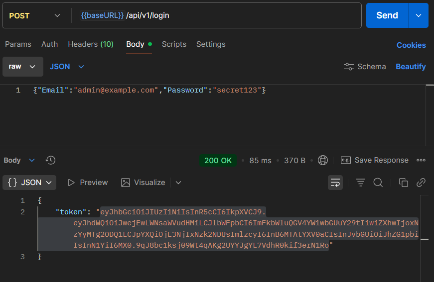
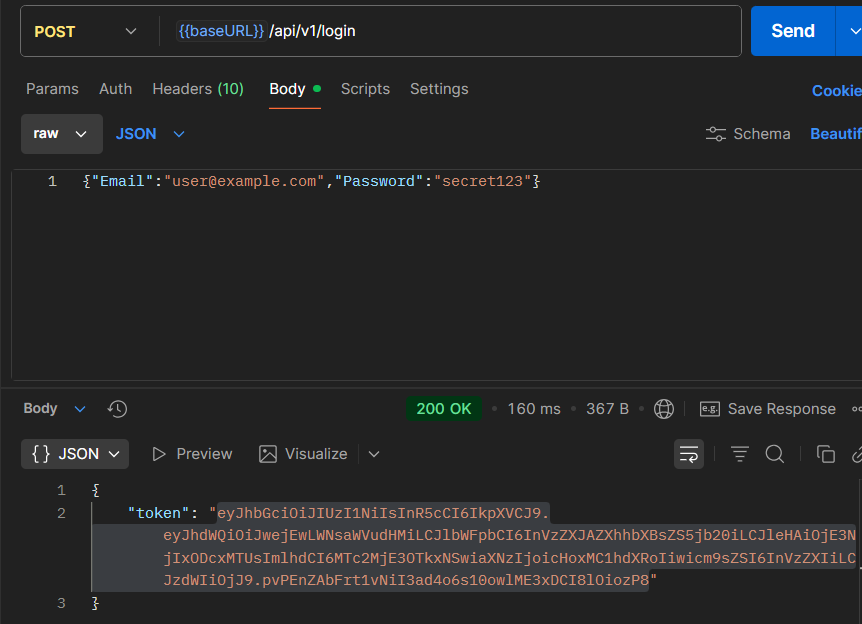
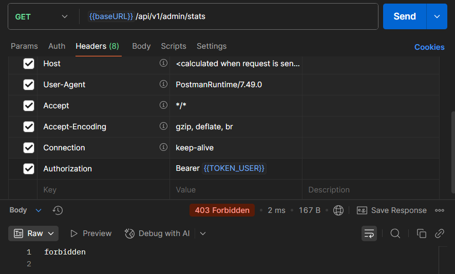
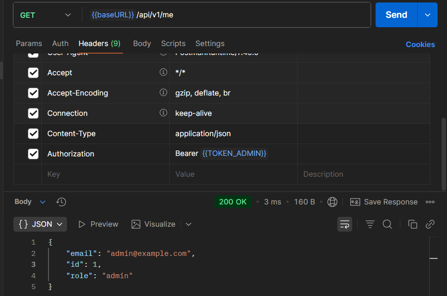
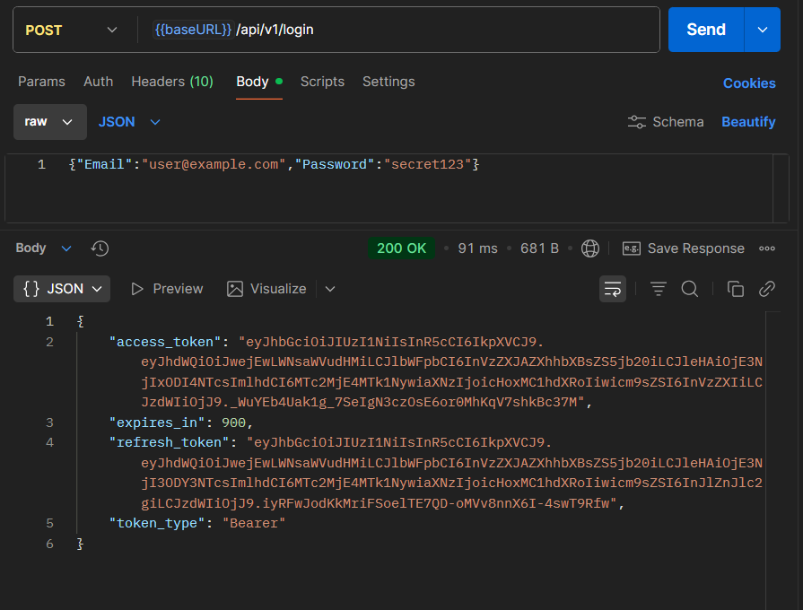
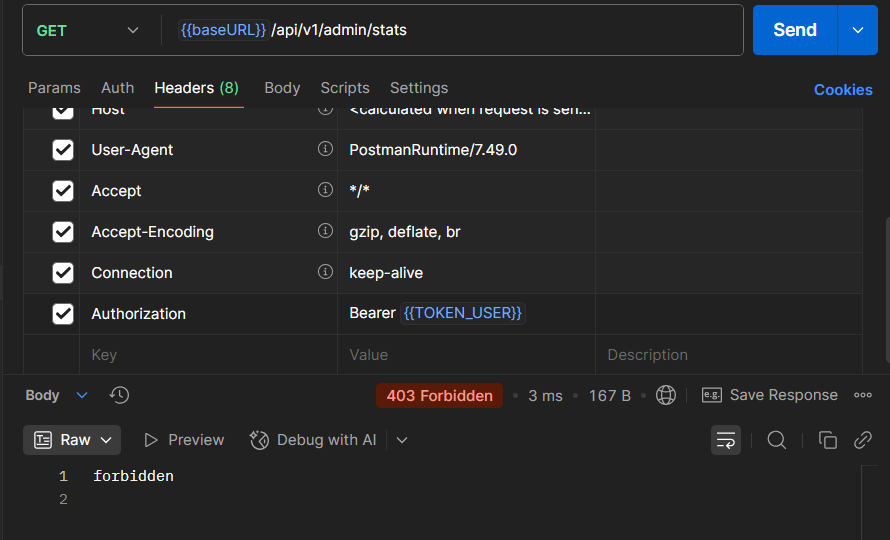

# Практическое занятие №10: JWT-аутентификация и авторизация в REST API
## Выполнил Туев Д. ЭФМО-01-25
## Описание проекта

Данный проект реализует полноценный механизм JWT-аутентификации и авторизации на базе Go. Сервис обеспечивает безопасный вход пользователей, выдачу долгоживущих refresh-токенов и короткоживущих access-токенов, обновление токенов, а также контроль доступа на основе ролей (RBAC) и атрибутов (ABAC).

**Основные компоненты:**
- JWT-токены с использованием алгоритма HS256 (HMAC-SHA256)
- Access-токены с TTL 15 минут и Refresh-токены с TTL 7 дней
- Middleware для аутентификации (AuthN) с проверкой подписи
- Middleware для авторизации (AuthZ) на основе ролей
- In-memory blacklist для отозванных токенов
- ABAC правила: пользователи видят только свои данные, администраторы видят любые данные
- Поддержка двух ролей: «admin» и «user»

## Структура проекта

```
pz10-auth/
├── cmd/
│   └── server/
│       └── main.go              # Точка входа, инициализация конфигурации и роутера
├── internal/
│   ├── core/
│   │   ├── user.go              # Доменная модель User
│   │   ├── service.go           # Обработчики логина, рефреша, выхода, получения данных
│   │   └── blacklist.go         # In-memory blacklist отозванных токенов
│   ├── http/
│   │   ├── router.go            # Конфигурация маршрутов chi и цепочка middleware
│   │   └── middleware/
│   │       ├── authn.go         # Middleware аутентификации (проверка JWT)
│   │       └── authz.go         # Middleware авторизации (проверка ролей)
│   ├── platform/
│   │   ├── jwt/
│   │   │   └── jwt.go           # Генерация и валидация JWT токенов
│   │   └── config/
│   │       └── config.go        # Загрузка конфигурации из переменных окружения
│   └── repo/
│       └── user_mem.go          # In-memory репозиторий пользователей с bcrypt-хешами
└── .env                         # Переменные окружения
```

## Ключевые фрагменты кода

### Генерация токенов

```go
func (h *HS256) Sign(userID int64, email, role string, ttl time.Duration) (string, error) {
    now := time.Now()
    claims := jwt.MapClaims{
        "sub":   userID,
        "email": email,
        "role":  role,
        "iat":   now.Unix(),
        "exp":   now.Add(ttl).Unix(),
        "iss":   "pz10-auth",
        "aud":   "pz10-clients",
    }
    t := jwt.NewWithClaims(jwt.SigningMethodHS256, claims)
    return t.SignedString(h.secret)
}
```

### Валидация токенов

```go
func (h *HS256) Parse(tokenStr string) (jwt.MapClaims, error) {
    t, err := jwt.Parse(tokenStr, func(t *jwt.Token) (any, error) { 
        return h.secret, nil 
    },
        jwt.WithValidMethods([]string{"HS256"}),
        jwt.WithAudience("pz10-clients"),
        jwt.WithIssuer("pz10-auth"),
    )
    if err != nil || !t.Valid {
        return nil, err
    }
    return t.Claims.(jwt.MapClaims), nil
}
```

### Middleware аутентификации

```go
func AuthN(v jwt.Validator) func(http.Handler) http.Handler {
    return func(next http.Handler) http.Handler {
        return http.HandlerFunc(func(w http.ResponseWriter, r *http.Request) {
            h := r.Header.Get("Authorization")
            if h == "" || !strings.HasPrefix(h, "Bearer ") {
                http.Error(w, "unauthorized", http.StatusUnauthorized)
                return
            }

            raw := strings.TrimPrefix(h, "Bearer ")
            claims, err := v.Parse(raw)
            if err != nil {
                http.Error(w, "unauthorized", http.StatusUnauthorized)
                return
            }

            claimsMap := make(map[string]any)
            for key, value := range claims {
                claimsMap[key] = value
            }

            ctx := context.WithValue(r.Context(), CtxClaimsKey, claimsMap)
            next.ServeHTTP(w, r.WithContext(ctx))
        })
    }
}
```

### Middleware авторизации

```go
func AuthZRoles(allowed ...string) func(http.Handler) http.Handler {
    set := map[string]struct{}{}
    for _, a := range allowed {
        set[a] = struct{}{}
    }

    return func(next http.Handler) http.Handler {
        return http.HandlerFunc(func(w http.ResponseWriter, r *http.Request) {
            claimsVal := r.Context().Value(CtxClaimsKey)
            if claimsVal == nil {
                http.Error(w, "forbidden", http.StatusForbidden)
                return
            }

            claims, ok := claimsVal.(map[string]any)
            if !ok {
                http.Error(w, "forbidden", http.StatusForbidden)
                return
            }

            role, _ := claims["role"].(string)
            if _, ok := set[role]; !ok {
                http.Error(w, "forbidden", http.StatusForbidden)
                return
            }

            next.ServeHTTP(w, r)
        })
    }
}
```

### Механика refresh-токенов

```go
func (s *Service) RefreshHandler(w http.ResponseWriter, r *http.Request) {
    var in struct {
        RefreshToken string `json:"refresh_token"`
    }
    if err := json.NewDecoder(r.Body).Decode(&in); err != nil || in.RefreshToken == "" {
        httpError(w, 400, "invalid_request")
        return
    }

    // Проверяем что refresh токен не отозван
    if s.blacklist.IsRevoked(in.RefreshToken) {
        httpError(w, 401, "token_revoked")
        return
    }

    claims, err := s.jwt.Parse(in.RefreshToken)
    if err != nil {
        httpError(w, 401, "invalid_token")
        return
    }

    if claims["role"] != "refresh" {
        httpError(w, 401, "invalid_token_type")
        return
    }

    userID := int64(claims["sub"].(float64))
    email := claims["email"].(string)
    
    // Получаем реальную роль пользователя из БД
    user, err := s.repo.GetUserByID(userID)
    if err != nil {
        httpError(w, 401, "user_not_found")
        return
    }
    userRole := user.Role

    // Добавляем старый токен в blacklist
    expiry := time.Unix(int64(claims["exp"].(float64)), 0)
    s.blacklist.Add(in.RefreshToken, expiry)

    // Выдаем новую пару с правильной ролью
    accessToken, _ := s.jwt.Sign(userID, email, userRole, 15*time.Minute)
    newRefreshToken, _ := s.jwt.Sign(userID, email, "refresh", 7*24*time.Hour)

    jsonOK(w, map[string]any{
        "access_token":  accessToken,
        "refresh_token": newRefreshToken,
        "token_type":    "Bearer",
        "expires_in":    900,
    })
}
```

### ABAC правило для получения данных пользователя

```go
func (s *Service) GetUserHandler(w http.ResponseWriter, r *http.Request) {
    idStr := chi.URLParam(r, "id")
    userID, err := strconv.ParseInt(idStr, 10, 64)
    if err != nil {
        httpError(w, 400, "invalid_user_id")
        return
    }

    claims := r.Context().Value(middleware.CtxClaimsKey).(map[string]any)
    tokenUserID := int64(claims["sub"].(float64))
    tokenRole := claims["role"].(string)

    // ABAC: user может получать только свои данные
    if tokenRole == "user" && tokenUserID != userID {
        httpError(w, 403, "forbidden")
        return
    }

    // admin может получать данные любого пользователя
    user, err := s.repo.GetUserByID(userID)
    if err != nil {
        httpError(w, 404, "user_not_found")
        return
    }

    jsonOK(w, map[string]any{
        "id":    user.ID,
        "email": user.Email,
        "role":  user.Role,
    })
}
```

### In-memory blacklist

```go
type Blacklist struct {
    tokens map[string]time.Time
    mu     sync.RWMutex
}

func (b *Blacklist) Add(token string, expiry time.Time) {
    b.mu.Lock()
    defer b.mu.Unlock()
    b.tokens[token] = expiry
}

func (b *Blacklist) IsRevoked(token string) bool {
    b.mu.RLock()
    defer b.mu.RUnlock()
    expiry, exists := b.tokens[token]
    if !exists {
        return false
    }

    // Если токен просрочен, удаляем его из blacklist
    if time.Now().After(expiry) {
        b.mu.RUnlock()
        b.mu.Lock()
        delete(b.tokens, token)
        b.mu.Unlock()
        b.mu.RLock()
        return false
    }

    return true
}
```

## Результаты тестирования


### Тестирование до выполнения всех требований

#### Аутентификация администратора


#### Получение администратором информации о себе


#### Получение администратором статистики


#### Аутентификация пользователя


#### Получение пользователем информации о себе


#### Получение пользователем статистики



### Тестирование после выполнения всех требований

#### Аутентификация администратора


#### Получение администратором информации о себе


#### Получение администратором статистики


#### Аутентификация пользователя


#### Получение пользователем информации о себе


#### Получение пользователем статистики



#### Механика refresh-токенов


#### Выход (logout) и отзыв refresh-токена


#### Попытка использовать отозванный refresh-токен


#### ABAC правила — получение собственных данных


#### ABAC правила — попытка получить данные другого пользователя


#### Администратор может получить данные любого пользователя


## API Маршруты

### Публичные маршруты

**POST /api/v1/login** — получить access и refresh токены

**POST /api/v1/refresh** — обновить access-токен используя refresh-токен

**POST /api/v1/logout** — отозвать refresh-токен (выход из системы)

### Защищенные маршруты (требуют access-токен)

**GET /api/v1/me** — получить информацию о текущем пользователе (доступно для admin и user)

**GET /api/v1/users/{id}** — получить информацию о пользователе (ABAC: user видит только себя, admin видит всех)

### Только для администраторов

**GET /api/v1/admin/stats** — получить статистику (доступно только для admin)

## Тестовые пользователи

В проекте используется in-memory база с тремя тестовыми пользователями:

| Email | Пароль | Роль |
|-------|--------|------|
| admin@example.com | secret123 | admin |
| user@example.com | secret123 | user |
| user2@example.com | secret123 | user |

## Переменные окружения

```
JWT_SECRET=dev-secret          # Секретный ключ для подписи JWT (обязательно)
APP_PORT=8080                   # Порт запуска сервера (по умолчанию 8080)
```

**Важно**: JWT_SECRET должен быть достаточно длинным и случайным в боевой среде.

## Запуск сервера

```bash
# Установка зависимостей
go mod download

# Запуск с переменными окружения
export JWT_SECRET=dev-secret
export APP_PORT=8080
go run ./cmd/server/main.go
```

Windows PowerShell:
```powershell
$env:JWT_SECRET="dev-secret"
$env:APP_PORT="8080"
go run ./cmd/server/main.go
```

Сервер начнет слушать на `http://localhost:8080`

## Postman коллекция

Для удобного тестирования API подготовлена полная Postman коллекция:

[Postman коллекция](https://lively-flare-564043.postman.co/workspace/My-Workspace~fe2081e8-b325-4776-8b48-400d41f5b4bd/collection/42992055-9a6079fc-fe39-4381-a55b-c5b391ff7077?action=share&source=copy-link&creator=42992055)

## Реализованные требования

✅ **JWT-аутентификация с HS256** — генерация и валидация токенов

✅ **Middleware аутентификации (AuthN)** — проверка Bearer токена в заголовке Authorization

✅ **Middleware авторизации (AuthZ)** — контроль доступа на основе ролей

✅ **Механика refresh-токенов** — access-токены (15 мин) и refresh-токены (7 дней)

✅ **Blacklist отозванных токенов** — in-memory хранилище с синхронизацией

✅ **ABAC правило для /users/{id}** — пользователи видят только свои данные

✅ **Логирование** — вывод информации о работе middleware в консоль

✅ **Безопасность** — правильные HTTP статусы (401, 403, 400)


## Выводы

### Почему JWT эффективнее сессий

Сессионный подход требует сервера для хранения всех активных сессий. При масштабировании это создает проблемы: нужна репликация состояния между серверами или центральное хранилище (Redis). JWT избавляет от этого: информация находится в самом токене, сервер только проверяет подпись.

### Разделение access и refresh токенов

Access-токены имеют короткий срок действия (15 минут) для минимизации урона при их компрометации. Refresh-токены имеют долгий срок (7 дней) и хранятся более безопасно. Если refresh-токен украден, его можно отозвать через blacklist, а украденный access-токен просто протечет за 15 минут.

### Importance of ABAC

Простое RBAC недостаточно для многих систем. ABAC позволяет реализовать правило: пользователь видит свой профиль, но не видит чужие. Администратор видит всё. Это комбинация разных типов доступа на одном ресурсе, что невозможно выразить только ролями.

### Middleware как стандарт

Middleware паттерн позволяет отделить логику аутентификации и авторизации от бизнес-логики обработчиков. Это делает код более тестируемым, переиспользуемым и понятным. Ключевой момент: порядок middleware важен. AuthN должна выполняться перед AuthZ.

## Контрольные вопросы
### 1.	Что такое клеймы JWT и чем отличаются registered, public, private? Почему важно exp? 

**JWT Claims** - это полезная нагрузка токена, содержащая утверждения о пользователе и метаданные.

#### Типы claims:

**Registered Claims** (зарегистрированные):
- Стандартные поля, определенные в RFC 7519
- Примеры: `iss` (issuer), `sub` (subject), `exp` (expiration), `iat` (issued at)
- Используются для базовой валидации токена

**Public Claims** (публичные):
- Пользовательские поля, зарегистрированные в IANA
- Должны быть уникальными чтобы избежать коллизий
- Пример: `email`, `role`, `permissions`

**Private Claims** (приватные):
- Кастомные поля для внутреннего использования приложения
- Пример: `user_id`, `department`, `preferences`

#### Важность `exp` (expiration):
```json
{
  "sub": "12345",
  "email": "user@example.com", 
  "role": "user",
  "exp": 1730659200,  // ← КРИТИЧЕСКИ ВАЖНО!
  "iat": 1730655600
}
```
- Безопасность: ограничивает время жизни токена

- Защита от утечки: украденный токен будет действителен только ограниченное время

- Автоматическая инвалидация: не нужно явно отзывать токены

### 2.	Чем stateless-аутентификация на JWT отличается от сессионных cookie на сервере? Плюсы/минусы. 
Ранее широко применялись **сессионные идентификаторы**: сервер при логине создавал запись в памяти/базе, а клиенту выдавался session_id в cookie. При каждом запросе сервер сверял его с таблицей активных сессий.

Минусы: нагрузка на сервер (хранение и поиск сессий), сложность масштабирования (надо реплицировать сессии между серверами).

**JWT (JSON Web Token)** решает проблему:
- В токене сразу зашита информация о пользователе и сроке действия.
- Серверу не нужно хранить состояние: достаточно верифицировать подпись.
- Клиент хранит токен (обычно в памяти приложения или localStorage).

#### Преимущества JWT

- **Stateless**: сервер не хранит сессии. Легко масштабировать.
- **Гибкость**: можно зашить любую информацию (роль, id, email).
- **Совместимость**: легко использовать между сервисами (SSO, микросервисы).

#### Недостатки JWT

- **Отзыв токена**: если токен выдан на 24 часа, его нельзя отозвать до истечения срока (если не реализовать blacklist/refresh-токены).
- **Размер**: токен может быть довольно большим (несколько сотен байт), что увеличивает нагрузку на сеть.
- **Безопасность хранения**: токен нельзя хранить в localStorage бездумно (опасность [XSS](https://habr.com/ru/articles/511318/)).

### 3.	Как устроена цепочка middleware и почему AuthZ должна идти после AuthN? 

- AuthN отвечает на вопрос "КТО?"
  - Валидирует JWT токен
  - Извлекает claims (sub, role, email)
  - Добавляет identity в контекст
- AuthZ отвечает на вопрос "ЧТО МОЖНО?"
  - Использует identity из AuthN
  - Проверяет права доступа
  - Применяет бизнес-правила

### 4.	RBAC vs ABAC: когда что выбирать? Примеры. 

#### RBAC (Role-Based Access Control)
Когда использовать RBAC:

- Простые системы с фиксированными ролями

- Статические права доступа

- Малое количество ролей (2-10)

Примеры RBAC:

- Блог: "author" может писать, "reader" только читать

- Интернет-магазин: "customer", "manager", "admin"

- Наш проект: "user" и "admin"
- 
#### ABAC (Attribute-Based Access Control)
Когда использовать ABAC:

- Сложные бизнес-правила

- Динамические условия доступа

- Множество атрибутов для принятия решений

Примеры ABAC:

- Медицинская система: "Врач может видеть истории болезней только своих пациентов из своего отделения"

- Банк: "Менеджер может одобрять кредиты до 1 млн, директор - до 10 млн"

- Наш проект: "User может получать /users/{id} только если {id} == sub из токена"

### 5.	Как безопасно хранить пароль и почему нужен bcrypt/argon2 вместо SHA-256? (коснитесь соли/pepper). 
При хранении хэша пароля утечка БД с пользовательскими данными не так страшна, поскольку по хэшу восстановить пароль невозможно,
а использование соли позволяет повысить уровень сложности хэширования пароля.  bcrypt - более сложный с точки зрения времени
и сложности вычисления, что значительно усложняет брутфорсинг пароля.
